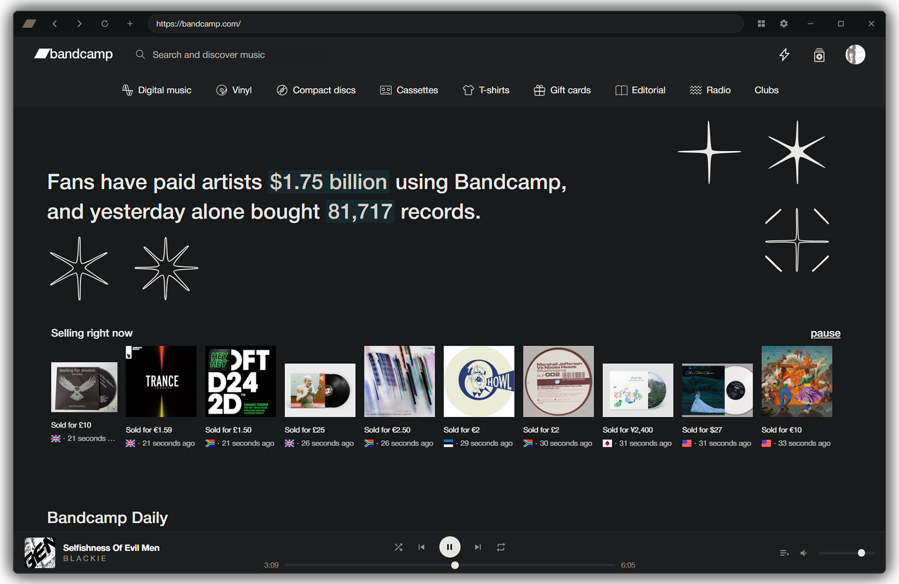

# Bandcamp Desktop (bandcamp-rpc)

🎵 A standalone **Bandcamp desktop client** for Windows & Linux, built on Electron.
It wraps Bandcamp in a clean, dark-themed shell with a snappier custom player, 
**Discord Rich Presence**, **Last.fm scrobbling**, a fast sortable collection 
view, and one-click downloads of your purchases. YAAAAAAA :D



---

## Features

- **Custom Player Bar**: A single, consistent transport (play/pause, prev/next, seek, volume, shuffle, repeat, queue panel) that works across release pages, playlists, the homepage, your feed, discover/genre pages, your collection and wishlist, instead of Bandcamp's per-page players.
- **Discord Rich Presence**: Shows what you're listening to. Works out of the box with a built-in app ID; the Discord desktop app just needs to be running.
- **Last.fm Scrobbling**: Enter your API key/secret, connect once, and it scrobbles + updates "now playing" automatically (authorization is auto-detected, no manual confirm step).
- **Custom Collection View**: A sortable/searchable grid of your whole collection (by artist, title, year, or date added). It pages in progressively and sorts client-side, so it isn't affected by Bandcamp's "can't sort over 1000 items" limit on the native page.
- **Download Your Purchases**: A download button on owned collection items lets you pick your format (including high-quality configurations like FLAC) and handles extraction smoothly.
- **Unified Controls**: Hardware layout binding that hooks media hotkeys directly into your active listening queue.

---

## Technical Specifications & Installation

### Build Setup

Ensure your local Node environment is operational before setting up the build paths.

```bash
# Install dependencies
npm install

# Run application in development window
npm run dev

# Bundle distribution binaries for your platform
npm run build
```

### Key Shortcuts

- `F12`: Toggles developer tools window.
- `Mouse Button 4` / `Mouse Button 5`: Natively maps browsing back and forward through layout view states.

---

## Configuration

Open **Settings** from the gear icon in the top bar.

### Last.fm Connection
1. Create an API account at <https://www.last.fm/api/account/create> to obtain an API key and shared secret configuration block.
2. Paste both tokens into Settings -> Last.fm and apply changes.
3. Choose "Connect account" to link your session securely.

### Discord Integration
Ensure the native client is running on the target machine. The runtime hooks automatically detect your user state profile and push rich presence asset arrays without secondary authentication layout panels.

---

## Disclaimer

This is an unofficial, fan-made client and is not affiliated with or endorsed by Bandcamp. It uses your own logged-in session cookies and official platform endpoints safely. Please support your favorite artists directly by buying music.